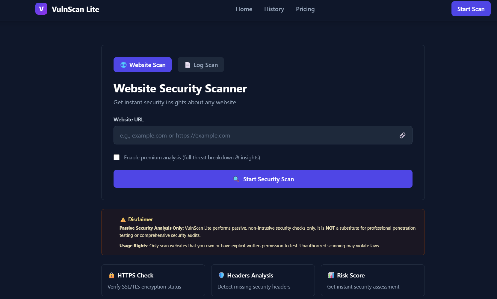
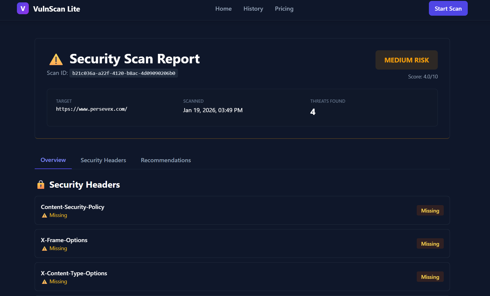
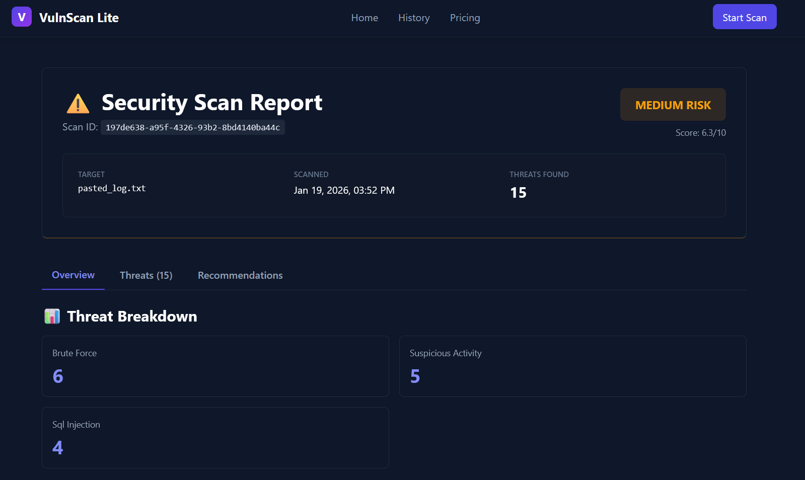
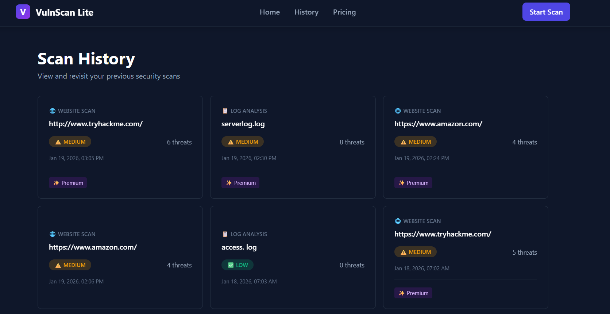

# 🔐 VulnScan – Web Vulnerability Scanning Platform

VulnScan is a **full-stack web vulnerability scanning platform** designed to analyze URLs and log files for potential security issues.  
The project focuses on **secure architecture, scalable backend design, and real-world deployment practices**, making it suitable for academic projects, internships, and portfolio demonstrations.

---

## 🚀 Live Demo

- **Frontend (Vercel):** https://vulnscan.vercel.app  
- **Backend API (Railway):** https://vulnscan-backend.up.railway.app  
- **API Documentation (Swagger):** https://vulnscan-backend.up.railway.app/docs  

---

## 📌 Project Objectives

- Build a **real-world vulnerability scanning application**
- Support **URL scanning** and **log file analysis**
- Maintain **scan history** for future reference
- Implement **clean frontend–backend separation**
- Deploy the project using **modern cloud platforms**
- Follow **industry-standard development and hosting practices**

---

## 🛠️ Technologies Used

### 🔹 Frontend
- React.js (Vite)
- HTML5, CSS3
- JavaScript (ES6+)
- REST API integration
- Deployed on **Vercel**

### 🔹 Backend
- Python
- FastAPI
- Uvicorn (ASGI server)
- RESTful API architecture
- Deployed on **Railway**

### 🔹 Database & Storage
- Persistent database for scan history
- Environment-based configuration using `.env`

### 🔹 DevOps & Tools
- Git & GitHub
- Railway (Backend hosting)
- Vercel (Frontend hosting)
- Swagger UI (API testing & documentation)

---

## 🧱 Project Architecture

```text
VulnScan/
├── frontend/
│   ├── src/
│   ├── public/
│   ├── package.json
│   └── vite.config.js
│
├── backend/
│   ├── app/
│   ├── main.py
│   ├── requirements.txt
│   └── .env
│
├── .gitignore
└── README.md
```

### Architecture Highlights
- Frontend and backend are **fully decoupled**
- Backend exposes **REST APIs**
- Frontend communicates via **secure API endpoints**
- Environment variables are used for sensitive data
- Ready for **scaling and feature expansion**

---

## ⚙️ Core Features

### 🔍 URL Vulnerability Scanning
- Accepts user-provided URLs
- Performs security checks
- Displays scan results in real time

### 📄 Log File Scanning
- Upload log files
- Analyze logs for suspicious patterns
- Store scan results for reference

### 🕘 Scan History
- Stores previous URL and log scans
- Enables review and auditing
- Persistent across sessions

### 📊 API Documentation
- Interactive Swagger UI
- Easy endpoint testing
- Clear request/response formats

---

## 🔐 Security Considerations

- No hardcoded secrets
- Environment variables for sensitive values
- CORS properly configured
- Clean API validation using FastAPI
- Separation of concerns between frontend and backend

---

## 🖼️ Screenshots

> 📌 Add your screenshots inside a folder named `screenshots/` in the root directory.

### 🔹 Home Page
```

```

### 🔹 URL Scan Feature
```

```

### 🔹 Log Scan Feature
```

```

### 🔹 Scan History
```

```

---

## 🧪 Running the Project Locally

### 🔹 Backend Setup
```bash
cd backend
pip install -r requirements.txt
uvicorn main:app --reload
```

Backend will run at:
```text
http://127.0.0.1:8000
```

Swagger Docs:
```text
http://127.0.0.1:8000/docs
```

---

### 🔹 Frontend Setup
```bash
cd frontend
npm install
npm run dev
```

Frontend will run at:
```text
http://localhost:3000
```

---

## 🌍 Deployment Details

### Backend
- Hosted on **Railway**
- Uses environment-based configuration
- Production ASGI server with Uvicorn

### Frontend
- Hosted on **Vercel**
- Auto-deploys on GitHub push
- Optimized Vite production build

---

## 📈 Future Enhancements

- Authentication & user accounts
- Role-based access control
- Advanced vulnerability detection
- PDF / CSV report generation
- Dashboard analytics
- CI/CD security scanning integration

---

## 👨‍💻 Author

**Debargha Naskar**  
- GitHub: https://github.com/Naruto-cyber13  
- Email: your-email@example.com  
- Project Repository: https://github.com/Naruto-cyber13/VulnScan  

---

## 📄 License

This project is licensed under the **MIT License**.  
You are free to use, modify, and distribute this project with attribution.

---

## ⭐ Acknowledgements

- FastAPI documentation
- OWASP security references
- Open-source community resources

---

⭐ If you found this project useful, consider giving it a star!

